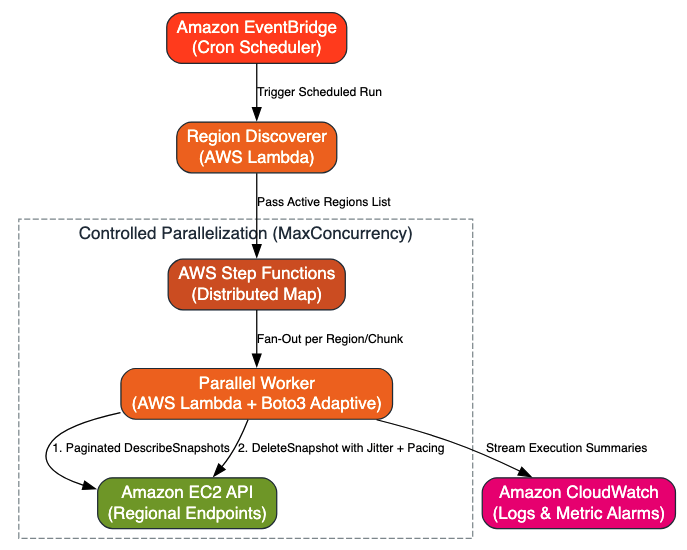

# AWS Multi-Region Resilient EBS Snapshot Cleanup



An enterprise-ready, serverless FinOps solution designed to safely scan, identify, and delete orphaned EBS snapshots older than 30 days across multiple AWS regions without hitting AWS API throttling limits (`RequestLimitExceeded`).

---

## Key Features

* **Resilient API Handling:** Built with Boto3 `adaptive` retry mode, exponential backoff, and full jitter to prevent AWS API rate-limiting.
* **Controlled Parallelization:** Uses AWS Step Functions Distributed Map to process global regions in parallel while enforcing `MaxConcurrency` controls.
* **Memory & Execution Efficient:** Leverages AWS S3/EC2 paginated requests (`PageSize: 500`) to handle thousands of snapshots smoothly.
* **AMI Dependency Protection:** Catches and logs locked snapshot exceptions (e.g., snapshots attached to active AMIs) without breaking execution loops.
* **Dry-Run Mode:** Supports a risk-free simulation mode to preview candidate snapshots before performing actual deletions.

---

## Architecture Overview

1. **Amazon EventBridge:** Fires a cron event (e.g., weekly) to trigger the cleanup workflow.
2. **Region Discoverer Lambda:** Queries EC2 to retrieve all active, enabled AWS regions in the account.
3. **AWS Step Functions (Distributed Map):** Distributes region-specific tasks to worker Lambdas in parallel with concurrency controls.
4. **Parallel Worker Lambdas:** Fetches regional snapshots via paginated requests, checks age thresholds (>30 days), and deletes expired snapshots using adaptive retries and pacing delays.
5. **Amazon CloudWatch:** Collects detailed logs and metric summaries for auditing and compliance tracking.

---

## Project Structure

```text
.
├── README.md
├── architecture.dot            # Graphviz source for architecture diagram
├── aws_architecture_diagram.png # Rendered architecture diagram
├── iam_policy.json             # Minimal IAM policy for Lambda Execution Role
├── src/
│   ├── discoverer_lambda.py    # Fetches active AWS regions
│   └── worker_lambda.py        # Scans and deletes stale snapshots per region
└── step_function_definition.json # Step Functions State Machine definition
```

---

## IAM Permissions & Policy

Create an IAM Role for the Lambda functions (e.g., `SnapshotCleanupLambdaRole`) with the following minimal privilege policy attached:

### `iam_policy.json`

```json
{
  "Version": "2012-10-17",
  "Statement": [
    {
      "Sid": "EC2SnapshotReadDeletePermissions",
      "Effect": "Allow",
      "Action": [
        "ec2:DescribeRegions",
        "ec2:DescribeSnapshots",
        "ec2:DeleteSnapshot"
      ],
      "Resource": "*"
    },
    {
      "Sid": "CloudWatchLoggingPermissions",
      "Effect": "Allow",
      "Action": [
        "logs:CreateLogGroup",
        "logs:CreateLogStream",
        "logs:PutLogEvents"
      ],
      "Resource": "arn:aws:logs:*:*:*"
    }
  ]
}
```

> **Note:** Ensure the Trust Relationship on the IAM Role allows `lambda.amazonaws.com` to assume the role.

---

## Deployment Steps

### Step 1: Deploy the Discoverer Lambda Function
1. Open the **AWS Lambda Console** and click **Create function**.
2. Name the function `snapshot-cleanup-discoverer`.
3. Choose runtime **Python 3.11** (or higher).
4. Assign the `SnapshotCleanupLambdaRole` created above.
5. Paste the code from `src/discoverer_lambda.py`.

### Step 2: Deploy the Worker Lambda Function
1. Create a second Lambda function named `snapshot-cleanup-worker`.
2. Choose runtime **Python 3.11** (or higher).
3. Assign the `SnapshotCleanupLambdaRole`.
4. Paste the code from `src/worker_lambda.py`.
5. Configure Environment Variables under **Configuration -> Environment variables**:
   * `DRY_RUN`: `true` *(set to `false` when ready to perform actual deletions)*
   * `DAYS_THRESHOLD`: `30`
6. Adjust the function timeout to **5 minutes** under **General configuration**.

### Step 3: Configure AWS Step Functions
1. Open the **AWS Step Functions Console** and click **Create state machine**.
2. Choose **Blank** or **Code** editor.
3. Import `step_function_definition.json` and replace the Lambda function ARNs with your deployed ARNs.
4. Enable **Distributed Map** mode with `MaxConcurrency: 10`.
5. Save the State Machine as `SnapshotCleanupOrchestrator`.

---

## Scheduling via Amazon EventBridge

Automate execution by attaching a scheduled cron rule:

1. Open the **Amazon EventBridge Console** and select **Rules -> Create rule**.
2. Name the rule `weekly-snapshot-cleanup-schedule`.
3. Set **Rule Type** to **Schedule**.
4. Define a Cron Expression (e.g., run every Sunday at midnight UTC):
   ```text
   cron(0 0 ? * SUN *)
   ```
5. Set the **Target** to **Step Functions State Machine** and select `SnapshotCleanupOrchestrator`.
6. Save and enable the rule.

---

## Verification & Testing

1. Run an initial manual execution of the Step Functions State Machine with `DRY_RUN = true`.
2. Review **Amazon CloudWatch Logs** for `snapshot-cleanup-worker` to inspect candidate snapshots marked for deletion:
   ```text
   [DRY-RUN] Would delete snapshot snap-0123456789abcdef0 in us-east-1 (Age: 42 days)
   ```
3. Once verified, update the `DRY_RUN` environment variable to `false` for automated production cleanup.
---
## AWS Architecture Diagram


